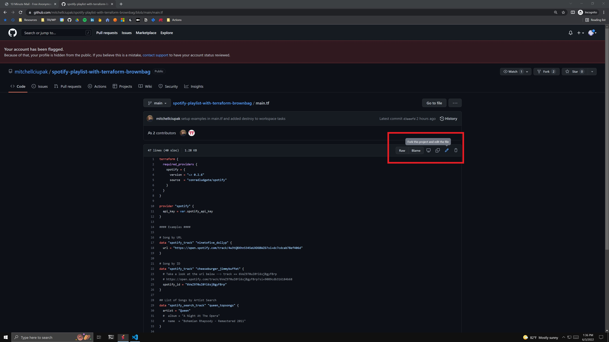
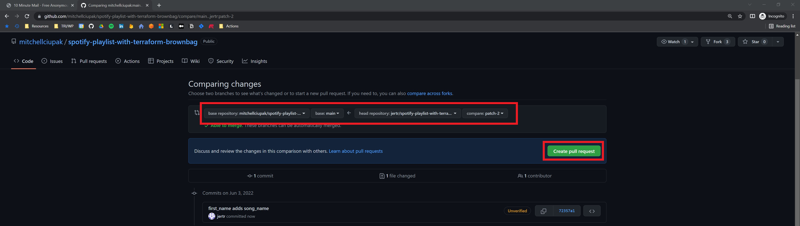
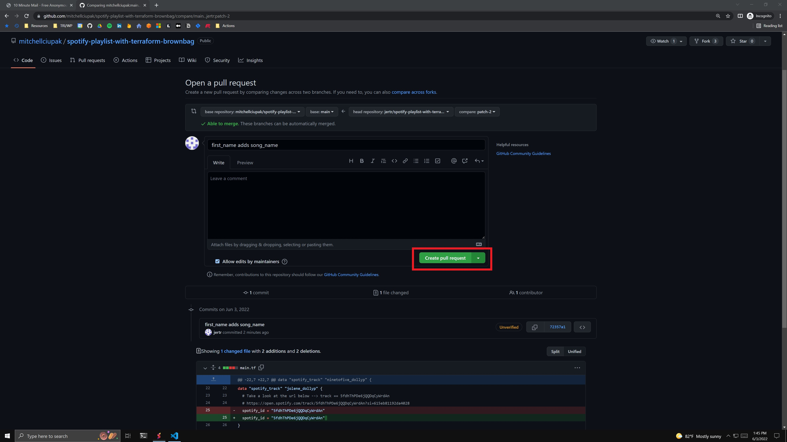
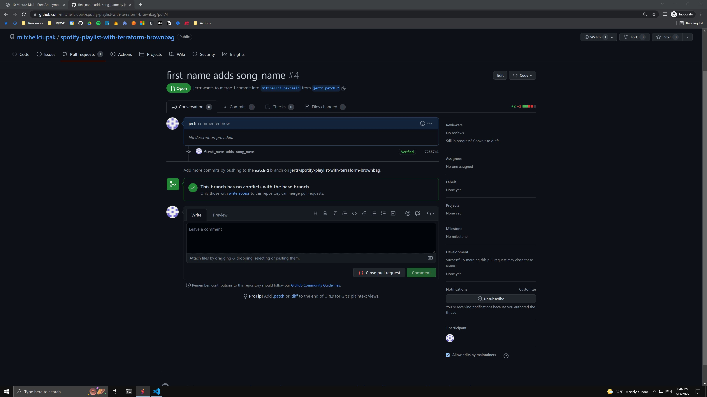

# Spotify-Playlist-with-Terraform-IaC
This is the Terraform Repo and presentation resources for the NIDC Introduction to IaC brownbag.

## Agenda
```
I. What is Infrastructure as Code?
  a. The Problem w/ Manual Configuration
  b. Infrastructure as Code (IaC)
II. Popular Infrastructure as Code Tools
  a. Declarative v. Imperative
  b. Declarative Examples (Azure Blueprints, AWS Cloudformation, Cloud Deployment Manager, **Terraform**)
  c. Imperative Examples (AWS CKD)
  d. More abt Terraform
III. Infrastructure Lifecycle
  a. What is an Infrastructure's Lifecycle?
  b. An Infrastructure Lifecycle Example
IV. Provisioning v. Deployment v. Ochestration
  a. Provisioning
  b. Deployment
  c. Ochestration
V. What is GitOps?
VI. Terraform Re-Intro
  a. What is Terraform Again?
  b. Terraform Lifecycle
  c. Change Automation
  d. Execution Plans
  e. Resource Graphs
  f. Use Cases
VII. (Workshop) Let's use some Terraform
  a. Code Review & How to Read HCL
  b. Get Connected to GitHub
  c. Find Your Song
  d. Create a PR
  e. Merge and Deploy!!!
```
## Contributing Rules
The following is an outline of the basic process of contributing to open source projects on GitHub:
### **Step 1: Create or Sign Into Your GitHub Account**
Please Refer to the [./presentation/IaC_brownbag_CreateAGitHubAccount.pdf](https://github.com/mitchellciupak/spotify-playlist-with-terraform-brownbag/blob/main/presentation/IaC_brownbag_CreateAGitHubAccount.pdf) document for instructions on how to signup for github, otherwise sign into your account at https://github.com/.
### **Step 2: Navigate to The 'spotify-playlist-with-terraform-brownbag' Repository**
Use the following link ot get to the 'spotify-playlist-with-terraform-brownbag' Repository: https://github.com/mitchellciupak/spotify-playlist-with-terraform-brownbag
### **Step 3: Add your song to [./main.tf](https://github.com/mitchellciupak/spotify-playlist-with-terraform-brownbag/blob/main/main.tf)**
1. Go to [./main.tf](https://github.com/mitchellciupak/spotify-playlist-with-terraform-brownbag/blob/main/main.tf) and select 'fork this project and edit this file' in the top right corner. This will automatically fork the original repository into your own account.

2. Add your song as a data element. Add that data element to the playlist. Click 'Propose Change'.

### **Step 4: Make a Pull Request**
1. Validate that you are pulling in the right commit and click 'Create Pull Request'.

2. Click 'Create Pull Request' Again.

3. Once you are on a page similar to this, you have sucessfully made a PR.

## Usage
If you are using vs code, open the directory with the workspace ./brownbag.code-workspace or refer to the following json for potential tasks
```
		"tasks": [
			{
				"label": "extensions-install",
				"type": "shell",
				"command": "sudo chmod 777 ./scripts/extensions-install.sh && ${workspaceFolder}/scripts/extensions-install.sh"
			},
			{
				"label": "tf-install",
				"type": "shell",
				"command": "sudo chmod 777 ./scripts/tf-install.sh && ${workspaceFolder}/scripts/tf-install.sh"
			},
			{
				"label": "tf-init",
				"type": "shell",
				"command": "cd ${workspaceFolder} && terraform init"
			},
			{
				"label": "run-proxy",
				"type": "shell",
				"command": "sudo chmod 777 ./scripts/run-proxy.sh && ${workspaceFolder}/scripts/run-proxy.sh"
			},
			{
				"label": "tf-apply",
				"type": "shell",
				"command": "cd ${workspaceFolder} && terraform apply"
			},
			{
				"label": "tf-destroy",
				"type": "shell",
				"command": "cd ${workspaceFolder} && terraform destroy"
			},
		]
```

## Resources
- [Terraform Official How To - Guide](https://learn.hashicorp.com/tutorials/terraform/spotify-playlist)
- [Terraform Official How To - Repo](https://github.com/hashicorp/learn-terraform-spotify)
- [Terraform Spotify Plugin](https://github.com/conradludgate/terraform-provider-spotify)
- [Terraform Overview](https://www.youtube.com/watch?v=V4waklkBC38)